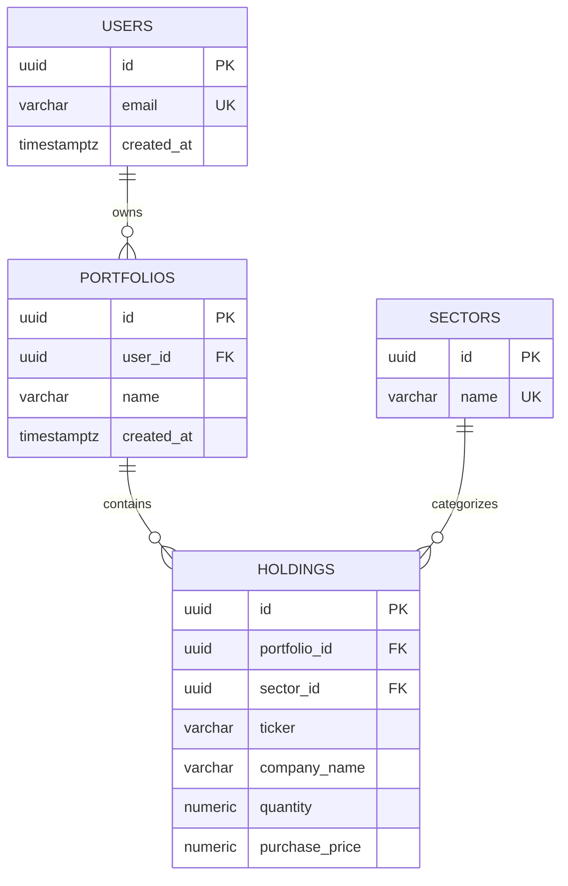

# Database Design Architecture

## 1. Portfolio Excel Analysis
A typical Excel export for a financial portfolio contains the following columns:
- **Ticker Symbol** (e.g., AAPL)
- **Company Name** (e.g., Apple Inc.)
- **Sector** (e.g., Technology)
- **Shares (Quantity)** (e.g., 50)
- **Buy Price** (e.g., 150.00)
- **Current Market Price (CMP)** (e.g., 175.00)
- **P/E Ratio** (e.g., 25.5)
- **Total Value** (e.g., 8750.00)
- **Profit/Loss** (e.g., 1250.00)

## 2. Data Categorization Strategy
To migrate this spreadsheet into a scalable web application, we must decouple the fields:

**Persistent Database Data (PostgreSQL)**
- `Ticker Symbol`
- `Company Name`
- `Sector`
- `Shares (Quantity)`
- `Buy Price`

**External Provider Data (Yahoo/Google Finance)**
- `Current Market Price (CMP)`
- `P/E Ratio`

**Calculated Backend Data (In-Memory)**
- `Total Value` (Shares * CMP)
- `Profit/Loss` (Total Value - (Shares * Buy Price))

## 3 & 4. Required Tables
1. `users`: Stores account information and credentials.
2. `portfolios`: Stores logical groupings of holdings for a user.
3. `sectors`: A lookup table for valid financial sectors to prevent data fragmentation.
4. `holdings`: Stores the actual positions, linking a ticker to a portfolio.

## 5. Justification of Tables
- **Why `sectors` instead of a string in `holdings`?** To enforce referential integrity and allow easy grouping/filtering on the frontend without dealing with typos (e.g., "Tech" vs "Technology").
- **Why decouple `portfolios` from `users`?** A single user may want a "Retirement" portfolio and a "Day Trading" portfolio. This normalizes the relationship.

## 6 & 7. Columns, Data Types, and Keys

### `users`
| Column | Type | Constraints | Description |
|---|---|---|---|
| `id` | UUID | PK, Default gen_random_uuid() | Primary key |
| `email` | VARCHAR(255) | UNIQUE, NOT NULL | User login email |
| `created_at` | TIMESTAMPTZ | Default NOW() | Audit timestamp |

### `portfolios`
| Column | Type | Constraints | Description |
|---|---|---|---|
| `id` | UUID | PK, Default gen_random_uuid() | Primary key |
| `user_id` | UUID | FK (users.id) ON DELETE CASCADE | Owner of the portfolio |
| `name` | VARCHAR(100) | NOT NULL | Display name |
| `created_at` | TIMESTAMPTZ | Default NOW() | Audit timestamp |

### `sectors`
| Column | Type | Constraints | Description |
|---|---|---|---|
| `id` | UUID | PK, Default gen_random_uuid() | Primary key |
| `name` | VARCHAR(100) | UNIQUE, NOT NULL | e.g., 'Technology' |

### `holdings`
| Column | Type | Constraints | Description |
|---|---|---|---|
| `id` | UUID | PK, Default gen_random_uuid() | Primary key |
| `portfolio_id`| UUID | FK (portfolios.id) ON DELETE CASCADE | Parent portfolio |
| `sector_id` | UUID | FK (sectors.id) | Sector grouping |
| `ticker` | VARCHAR(20) | NOT NULL | Stock symbol |
| `company_name`| VARCHAR(255) | NOT NULL | Display name |
| `quantity` | NUMERIC(15,6) | NOT NULL | Number of shares owned |
| `purchase_price`| NUMERIC(15,2) | NOT NULL | Cost basis per share |

## 8. Indexes for Performance
- `CREATE INDEX idx_holdings_portfolio_id ON holdings(portfolio_id);` (Speeds up fetching all holdings for a dashboard).
- `CREATE INDEX idx_portfolios_user_id ON portfolios(user_id);` (Speeds up user login fetching).
- `CREATE INDEX idx_holdings_sector_id ON holdings(sector_id);` (Speeds up sector aggregation).

## 9. Unique Constraints
- `users.email`: Enforces one account per email.
- `sectors.name`: Prevents duplicate sectors.
- `UNIQUE(portfolio_id, ticker)` on `holdings`: Ensures a portfolio only has one aggregated record per ticker. (If a user buys AAPL twice, the backend should aggregate it into a single holding via average cost).

## 10. Check Constraints
- `quantity`: `CHECK (quantity > 0)` (Prevents short selling or empty rows).
- `purchase_price`: `CHECK (purchase_price > 0)` (Assets cannot be free or negative).
- `ticker`: `CHECK (LENGTH(TRIM(ticker)) > 0)` (No empty tickers).

## 11 & 14. Entity Relationship Diagram

## 12. Why Live Financial Fields Are Not Stored
Fields like `current_market_price` and `profit_loss` change every second during market hours. Storing them in PostgreSQL would require constant `UPDATE` statements, leading to:
1. Massive Write-Ahead Log (WAL) bloat.
2. Index fragmentation and vacuum thrashing.
3. Stale data the moment the write completes.
By delegating these fields to Yahoo/Google Finance and computing them in-memory, the database remains pristine, scalable, and fully ACID-compliant for static ownership records.

## 13. Seed Data Strategy (Excel Import)
To migrate the initial Excel portfolio into PostgreSQL, we will use a database seeding script (`prisma/seed.ts` or a raw SQL node script):
1. **Parse**: Export Excel to CSV. Use a library like `csv-parser` in Node.js to read the data.
2. **Normalize Sectors**: Extract all unique Sector names from the CSV. Insert them into the `sectors` table and map their returned UUIDs in memory.
3. **Initialize User/Portfolio**: Create a default User and a default "Initial Import" Portfolio.
4. **Insert Holdings**: Map the CSV rows to the `holdings` table, mapping the `Ticker`, `Shares`, and `Buy Price` directly, while using the in-memory map to attach the correct `sector_id` and `portfolio_id`.
