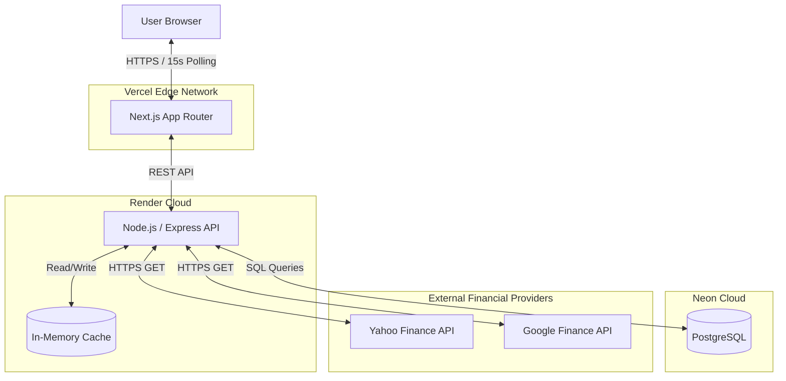

# Deployment Architecture

## Overview
The platform utilizes a decoupled, modern cloud-native deployment strategy designed for global edge delivery on the frontend and scalable compute on the backend.

## Component Deployment

1. **Next.js Frontend (Vercel)**
   - Deployed on Vercel's Edge Network.
   - Assets are cached globally via Vercel's CDN.
   - Client-side code runs in the user's browser, managing the 15-second polling interval.

2. **Express Backend (Render)**
   - Deployed as a Render Web Service.
   - Exposes RESTful APIs on a centralized domain.
   - Handles the heavy lifting of orchestration and computation.
   - Scales horizontally based on CPU/Memory load.

3. **Database (Neon PostgreSQL)**
   - Serverless PostgreSQL deployment.
   - Scales compute dynamically based on connection load.
   - Handles automated backups and branching for zero-downtime migrations.

4. **External Providers (Yahoo/Google)**
   - Third-party SaaS endpoints accessed via secure HTTPS from the Render backend.

## Deployment Architecture Diagram

