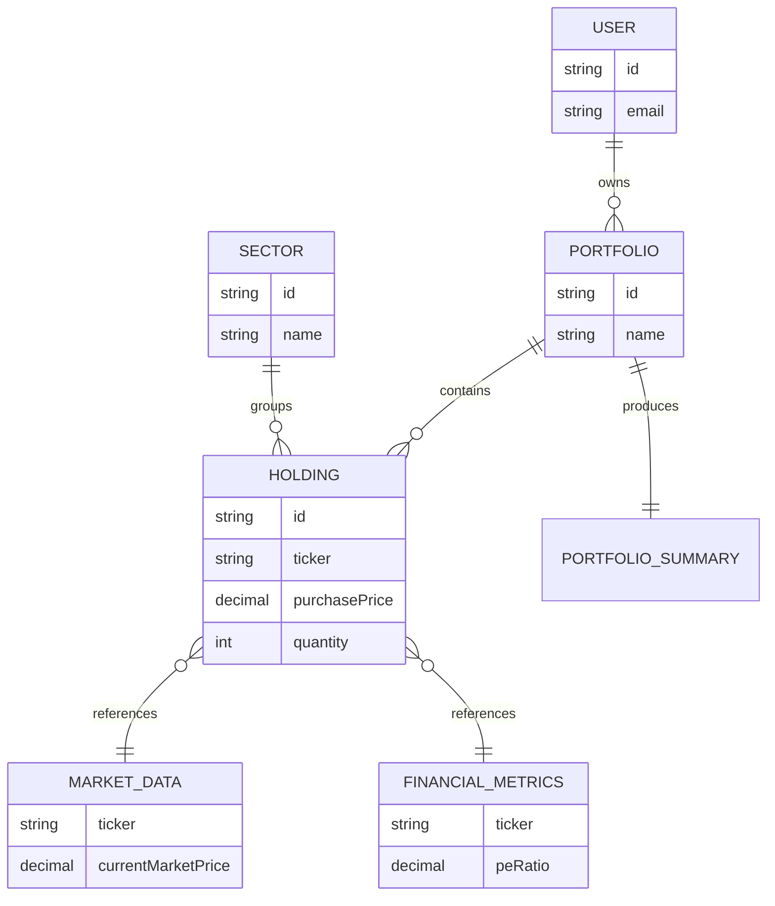

# Domain Model

## Entities & Responsibilities
1. **User**: The owner of portfolios. Exists to enforce authentication, authorization, and data isolation.
2. **Portfolio**: A logical grouping of investments. Exists to aggregate Holdings into a single viewable entity.
3. **Holding**: Represents a specific stock position in a portfolio. Exists to track cost basis and quantity over time.
4. **Sector**: A categorization of Holdings (e.g., Technology, Healthcare). Exists to allow grouping and sector-level performance analysis.
5. **MarketData**: Represents real-time stock pricing. Exists to provide the current value of Holdings.
6. **FinancialMetrics**: Represents fundamental business data (P/E, Earnings). Exists to provide context on the quality/valuation of the Holding.
7. **PortfolioSummary**: An aggregated wrapper entity. Exists to present the total calculated state of a Portfolio to the client.
8. **CacheEntry**: Temporary storage for external API responses. Exists to prevent rate-limiting and ensure 15-second refresh performance.

## Attributes & Data Classification
### User
- `id` (Static): Unique identifier.
- `email` (Static): User contact and login.

### Portfolio
- `id` (Static): Unique identifier.
- `userId` (Static): Foreign key to User.
- `name` (Static): Display name.

### Sector
- `id` (Static): Unique identifier.
- `name` (Static): Human-readable sector name (e.g., Technology).

### Holding
- `id` (Static): Unique identifier.
- `portfolioId` (Static): Foreign key to Portfolio.
- `ticker` (Static): Stock symbol (e.g., AAPL).
- `stockName` (Static): Display name of the company.
- `purchasePrice` (Static): Average cost basis per share.
- `quantity` (Static): Number of shares owned.
- `exchange` (Static): Trading exchange (e.g., NASDAQ).
- `sectorId` (Static): Foreign key to Sector.

### MarketData
- `ticker` (Static): The asset being tracked.
- `currentMarketPrice` (Dynamic): Changes constantly during market hours.
- `dayChange` (Dynamic): Value change on the current day.

### FinancialMetrics
- `ticker` (Static): The asset being tracked.
- `peRatio` (Dynamic): Changes daily based on price and earnings.
- `latestEarnings` (Dynamic): Changes quarterly.

### PortfolioSummary
- `totalInvestment` (Calculated): Sum of all Holding investments.
- `totalPresentValue` (Calculated): Sum of all Holding present values.
- `totalGainLoss` (Calculated): `totalPresentValue` - `totalInvestment`.

### CacheEntry
- `key` (Static): Cache identifier (e.g., `market_data_AAPL`).
- `value` (Dynamic): The cached JSON payload.
- `expiresAt` (Dynamic): TTL timestamp.

*Why Classification Matters:* 
- Static data is immutable or changes rarely via explicit user action.
- Dynamic data is volatile and driven by external forces (markets).
- Calculated data is derived and should never be persisted to avoid stale state.

## Data Ownership
- **User, Portfolio, Sector, Holding**: Stored in PostgreSQL.
- **MarketData (currentMarketPrice, dayChange)**: Retrieved from Yahoo Finance.
- **FinancialMetrics (peRatio, latestEarnings)**: Retrieved from Google Finance.
- **PortfolioSummary (totalInvestment, totalPresentValue, totalGainLoss, percentage)**: Calculated by Backend.
- **Formatting, Colors (Red/Green), Localization**: Displayed by Frontend.

## Business Relationships
- **User** *owns* **Many Portfolios**
- **Portfolio** *contains* **Many Holdings**
- **Holding** *belongs to* **One Sector**
- **Sector** *groups* **Many Holdings**
- **Holding** *references* **One MarketData**
- **Holding** *references* **One FinancialMetrics**
- **Portfolio** *produces* **One PortfolioSummary**
- **ExternalProvider** *supplies* **Many MarketData / FinancialMetrics**
- **CacheEntry** *temporarily stores* **MarketData / FinancialMetrics**

## Business Domain Diagram

