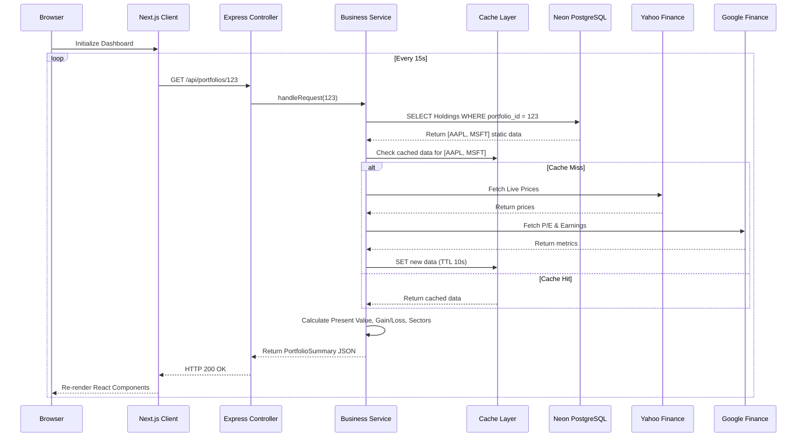

# Request Lifecycle & Separation of Responsibilities

## Complete Request Lifecycle

When the frontend 15-second polling interval triggers, the following flow executes:

1. **Browser**: Next.js client-side code fires an asynchronous HTTP GET request (`/api/v1/portfolios/{id}`).
2. **Next.js**: SWR or React Query manages the loading state and network request.
3. **Express Controller**: Intercepts the request, validates the JWT auth token, extracts the Portfolio ID, and calls the Service layer.
4. **Service**: Core business logic orchestrator. Requests Holdings from Database.
5. **Database (Neon)**: Returns the static array of Holdings (Ticker, Quantity, Purchase Price) for the given Portfolio.
6. **Cache (Redis/In-Memory)**: Service checks the Cache for MarketData and FinancialMetrics using the retrieved Tickers.
7. **Yahoo Provider**: For cache misses, Service makes a bulk HTTP request to Yahoo Finance for live `currentMarketPrice`.
8. **Google Provider**: For cache misses, Service makes a bulk HTTP request to Google Finance for `peRatio` and `latestEarnings`.
9. **Business Calculations**: Service takes static Database data + dynamic Provider data and executes all Business Rules (Total Value, Gain/Loss, Sector Groupings).
10. **Response**: Express Controller serializes the calculated `PortfolioSummary` into JSON and returns `200 OK`.
11. **Browser**: React diffs the DOM and paints updated colors/numbers without a full page reload.

## Separation of Responsibilities

- **Frontend (Next.js/React)**: Responsible strictly for presentation, polling execution, optimistic UI updates, and locale-based formatting (e.g., currency symbols, red/green coloring). Must never calculate financial totals.
- **Backend (Express/Node.js)**: Responsible for authentication, validation, orchestration, and all financial mathematics. Must never store HTML/UI state.
- **Database (PostgreSQL/Neon)**: Responsible for persistent, ACID-compliant storage of user facts (Portfolios, Holdings, Sectors). Must never store volatile market prices.
- **Cache**: Responsible for buffering identical outgoing requests to third-party APIs. Must always have a strict TTL (e.g., 10 seconds) to ensure the 15-second refresh SLA gets fresh data without hitting rate limits.
- **Yahoo Provider**: The authoritative source for high-frequency pricing data.
- **Google Provider**: The authoritative source for low-frequency fundamental business metrics.

## Request Flow Diagram

